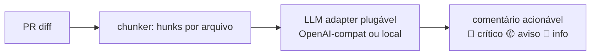

# CodeReview Bot — AI Code Review on GitHub Actions

-brightgreen)

A GitHub Action that reviews pull requests with AI: fetches the PR diff, sends it through a
pluggable LLM adapter (OpenAI-compatible or local llama.cpp), and posts actionable review
comments back to the PR.

> 🇧🇷 Uma GitHub Action que revisa PRs com IA: pega o diff, passa por um adapter LLM
> plugável (OpenAI-compat ou llama.cpp local) e publica comentários acionáveis no PR.

## Features

- [x] **M1a** — Action: PR diff → chunks → LLM adapter → review comments (`action.yml` + `src/cr.js`)
- [x] **Core testado (8/8):** chunker de hunks, filtro por arquivo, adapter mock determinístico
      (detecta senha hardcoded, `eval()`, console.log, promise sem catch), markdown do comentário
- [x] **M1b (parcial):** config via inputs (idioma, severidade, ignorados) + CI com license-check
- [ ] **M1b (falta):** `.github/cr.yml` por repositório
- [ ] **M2** — Review memory, executive summary, adapter contract tests

## Como funciona

## Built with

- LLM adapter pattern proven in my private AI lab (`ai_video_automation` stack)
- References: [anc95/ChatGPT-CodeReview](https://github.com/anc95/ChatGPT-CodeReview),
  [vercel-labs/openreview](https://github.com/vercel-labs/openreview)

## License

MIT — Rodolfo Franco ([FrancosCorporation](https://github.com/FrancosCorporation))
